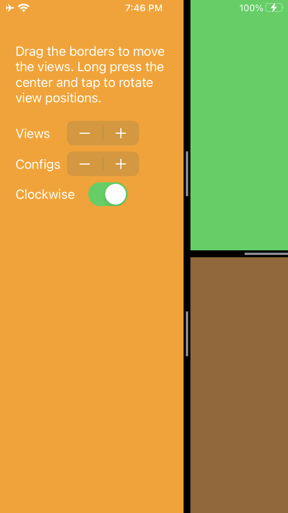
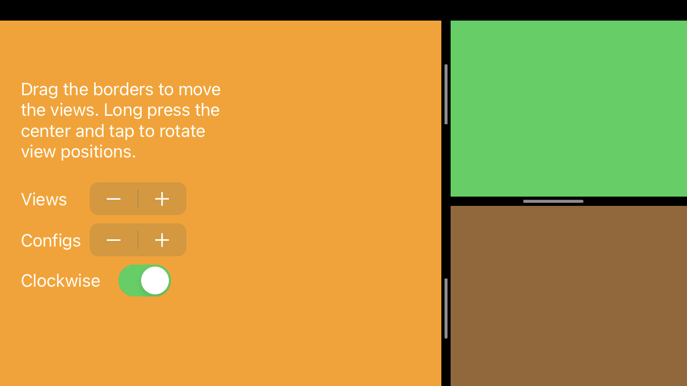
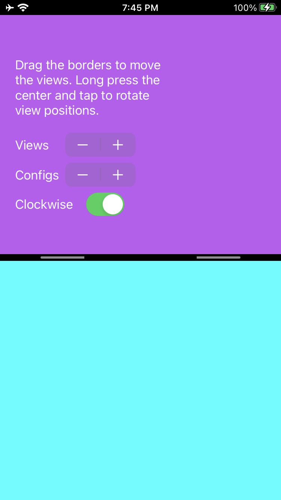

#  SlideViewController





Do you need to display multiple UIVIewControllers in a small space? Do their frames need to be user adjustable? That's what SlideViewController is for.
Automatically displays up to four views depending on how many views it is sent. Can be configured with a horizontal or vertical orientation and to rotate clockwise or counter-clockwise.
This swift UIViewController subclass requires iOS 13+ or macOS Catalyst 10.15+.

Slider Gestures:
* PAN will move the slider around.
* LONGPRESS will toggle edit mode on and off.
* TAP during edit mode will rotate the views. Or you can set it to change the configuration(horizontal/vertical/top/bottom) by calling `changeGridStyle`.

As easy as creating the view then giving it some viewControllers

For example:
```swift
let subViewControllers = [zxyMapController, xyzFavesTableController, zxySettingController]
let slideController = SlideViewController(newViewControllers: subViewControllers) //Sets view position based in order (ie 0 = Primary, 1 = Secondary, etc.)
```
Funtionality options:
* Many of these options as well as the options for the slider will be broken out to a struct that can be passed at any time. For now, many are private and are not meant to be called during runtime, but can.
```swift
public var gridStyle:SlideViewPositions = .Primary
public var rotateViewClockwise = false
```

* If a rotation event is fleeting, get out of it after one rotation.
```swift
private var stopEditAfterRotate = false
```

* Edit mode can be set here, must update views after this is set.
```swift
public var editModeActive = false
```
* Make it so the slider will only move in one direction.
```swift
private var xyLock: (x:Bool,y:Bool) = (false,false)
```

Accessibility options:
* SlideView Call out the slider location, but will not call out child view locations. Possible for future update.


To Fix:
* ~~Add accessibility~~ Catalyst accessibility needs work/Slider's voiceover script needs to support internationalization, just english for now.
* When adding views, if you are in edit mode, new views do not get rounded corners.
* ~~Single view mode is currently stuck in the upper left hand corner.~~
* Change "config" to primary view position and change SliderViewPosition to something else
